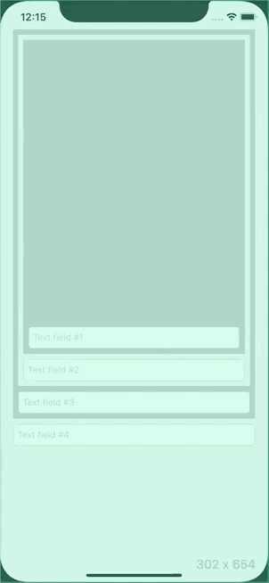

# KeyboardDucker
KeyboardDucker offers a clean and lightweight solution for ensuring that the currently active text field never gets obscured by the keyboard.

## Installation

#### CocoaPods
You can use [CocoaPods](http://cocoapods.org/) to install `KeyboardDucker` by adding it to your `Podfile`:

```ruby
platform :ios, '11.0'
use_frameworks!
pod 'KeyboardDucker'
```
## Usage example

```swift
import UIKit
import KeyboardDucker 

class ViewController: UIViewController, KeyboardDucking {
    override func viewWillAppear(_ animated: Bool) {
        super.viewWillAppear(animated)
        
        startDuckingKeyboard()
    }

    override func viewWillDisappear(_ animated: Bool) {
        super.viewWillDisappear(animated)
        
        stopDuckingKeyboard()
    }
}
```
## In action



## Meta

Levente Dimény – [@leventedimeny](https://twitter.com/leventedimeny)

Distributed under the MIT license. See ``LICENSE`` for more information.
